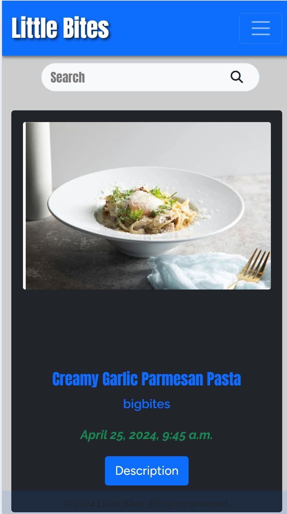
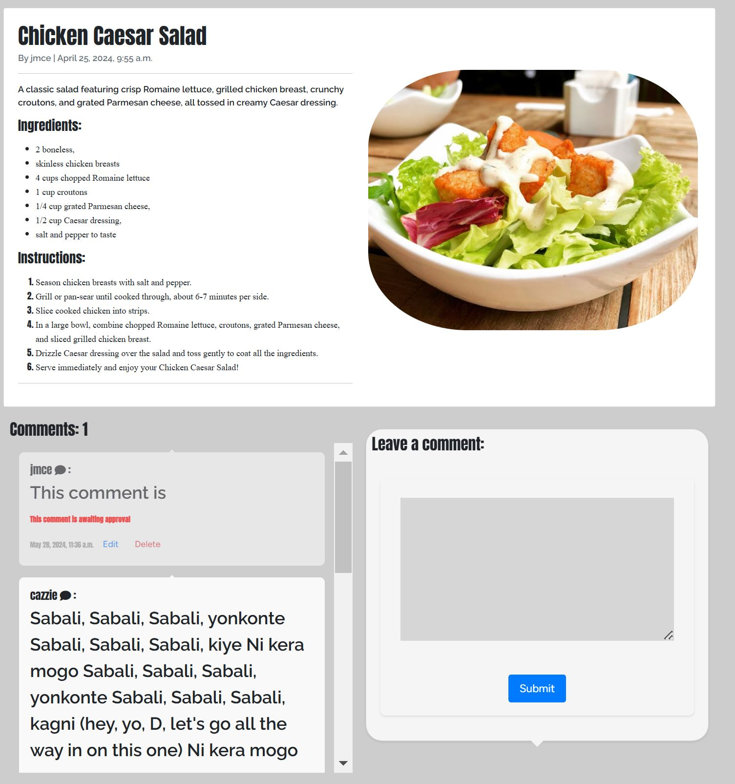
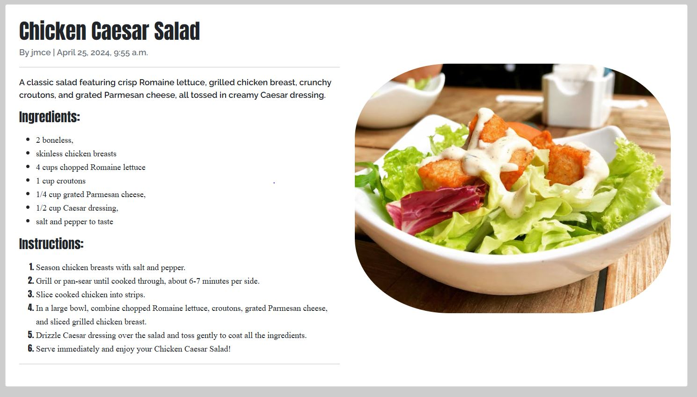
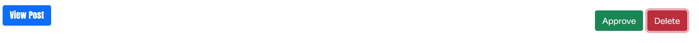
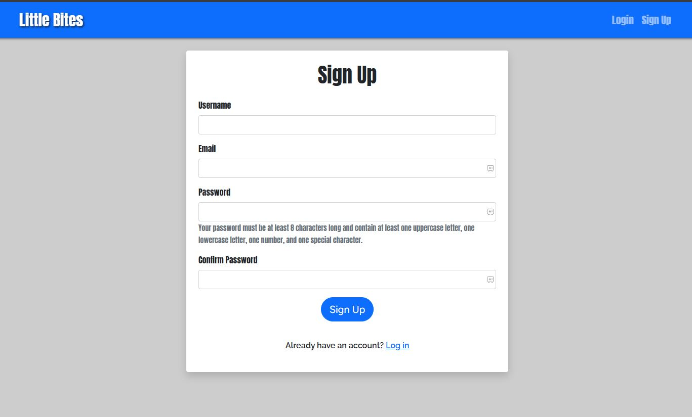
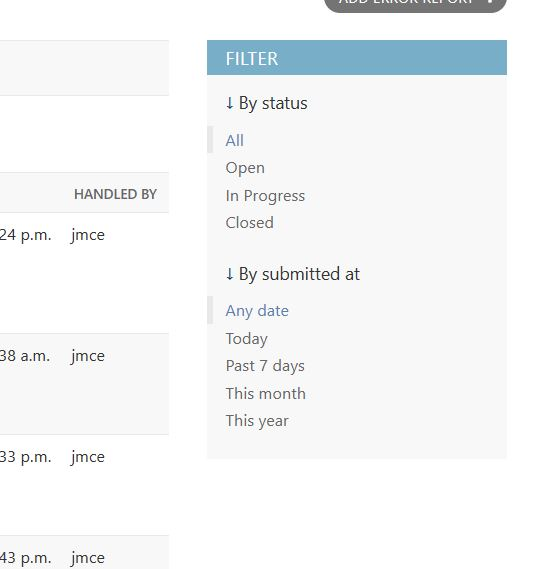
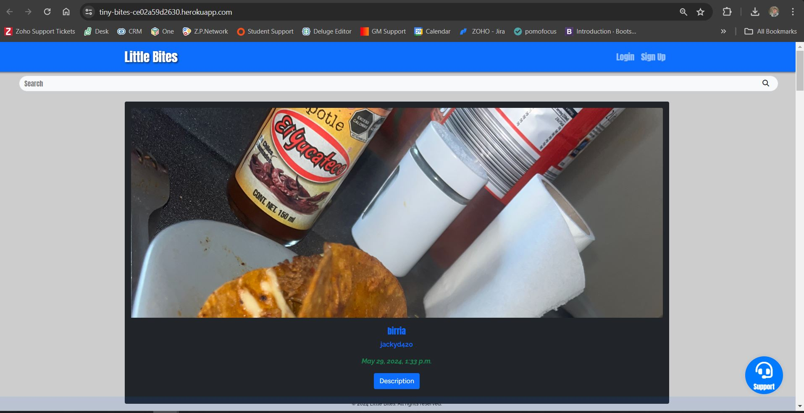

# Tiny Bites

[Tiny Bites](https://tiny-bites-ce02a59d2630.herokuapp.com/)

Tiny Bites is more than just a food website; it's a culinary community where users can unleash their creativity by crafting their own delectable bites to share with the platform.

Whether it's a gourmet twist on instant noodles or a cherished lunchtime BLT spot, Tiny Bites invites users to explore and celebrate the world of snacks and tiny delights. With a focus on user-friendly design, the platform aims to provide a seamless experience for posting recipes and sharing ratings. It's not just about food; it's about sharing thoughts, emotions, and experiences surrounding everyone's ultimate passion: food.


## User Needs

- **Cross-Device Accessibility**: Users expect seamless access to the website from any device, whether it's a smartphone, laptop, tablet, or desktop.
- **Responsive Design**: A responsive design is crucial to ensure that the website adapts and delivers an optimal viewing experience across all screen sizes, ensuring readability and usability.
- **Easy Posting**: Users should be able to effortlessly share their culinary creations with clear, intuitive posting guidelines.
- **Efficient Account Creation**: A quick and hassle-free account creation process is essential to encourage user participation.
- **Visual Appeal**: Users want to showcase their culinary creations through captivating images that highlight the aesthetic appeal of their bites.
- **User-centric Navigation**: Users need to easily navigate through their own posts, find specific recipes, and manage their comments and posts effectively.

#### User Stories 

- I came up with the following user stories, I am going to use these stories to put myself in the position of the user and allow but to keep UI in mind at all stages during development. 
- Also, they will allow me to use an Agile Development, Agile promotes iterative development, where features are delivered incrementally in short cycles called sprints. This allows for regular feedback from stakeholders and users, leading to quicker adjustments and improvements. With this in mind, I tackled one issue at a time and took time after each session to reflect and compare to other social media sites along with research.
- Each Story is assigned a number in GitHub which I have used below, this is how I will be referring to them in the features section. User.Story.Number (e.g. U.S.1).

```
Feed In Admin
U.S.1

Ability to create users
U.S.2

Display my feed
U.S.3

View Scroll list of posts
U.S.4

Open a post
U.S.6

View A Comment
U.S.7

Comment on a post
U.S.8

Pagination on List view like index and My Bites
U.S.9

To be Approved page
U.S.10

Approve Comments
U.S.11

Edit Post
U.S.12

Navbar Show Active
U.S.13

Edit Comments
U.S.15

Delete Comments
U.S.16

Search Bar
U.S.17

Pagination - page number
U.S.18

Profile Setting
U.S.19

Delete post
U.S.20
```

## Planning

Before embarking on the development journey, meticulous planning was undertaken to conceptualize the layout, define essential fields, and establish the Database Schema.

### Planned Design

- Because there was some many pages within this project I didnt find a need to map out each page instead once I established the theme of the page with the index/home I would fit the other pages around this.
- In the following parraghraphs I want to show you the index and how it contributed to the my bites and to be approved page

#### Large Screen Layout

- The large screen layout provides ample space for users to navigate comfortably, with distinct sections for easy access to various features and functionalities.


#### Small Screen Layout

- The small screen layout prioritizes readability and usability, with optimized design elements to enhance the mobile browsing experience.


- For the smaller screen I am planning to hide all the nav items in a menu activated by a burger icon.


- As mention at the start of the sections I wanted to get the index page down first, The reason being is through to the process of trying to create a view I thought would fit this purpose I createda few mock ups in which I will use to create my_bites and to be approved.
- My first idea for the index was to make it minial as possible more compact. I did think that page deserved a little more effort and it difinately would bring more apeal. However, the to be approved section is best suited to be compact and shouldnt use much imformation in fact it would take away from the purpose of the page if I added any more. I just needed to add some aprrove abnd delete buttons
  
- The my bites if felt held a similar purposes so I propoed a similar style but I wanted to make a backup design, so I could mock up both stlye and see if it is best to set that page apart or keep it similar.

##### Choice  1 :


##### Choice 2 : 


- I don't want to get stuck on the planning to long so I decided to try both in the bulid stage and see which one suits better, maybe get a second option on it.

### Database Schema

- Here is the database schema I created. I later took the review sections out so below you will need the old and new schema.


#### Fonts

- Through google searchs I tried to find different font to fit differnt place instead of having them all under one.
  - Anton
  - Figtree
  - Raleway 
##### Anton
- **Usage**: Best suited for headings and titles.
- **Description**: Anton is a bold, attention-grabbing typeface with high contrast and distinct characters. It is characterized by its thick strokes and narrow spacing, making it perfect for headlines and emphasis.
- **Why it's good for headings (body)**: With its bold and impactful appearance, Anton commands attention and ensures that headings stand out prominently on the page. It adds a sense of authority and modernity to the text, making it ideal for grabbing the reader's attention at a glance.

##### Raleway
- **Usage**: Suitable for body text and paragraphs.
- **Description**: Raleway is a versatile sans-serif font known for its clean lines and geometric shapes. It offers a modern and sophisticated look while maintaining excellent readability across different screen sizes and resolutions.
- **Why it's good for paragraphs (p)**: Raleway's simplicity and clarity make it an excellent choice for body text and paragraphs. Its clean design ensures that text remains legible even when presented in large blocks, enhancing the readability of the content and providing a pleasant reading experience for users.

##### Figtree
- **Usage**: Ideal for buttons.
- **Description**: Figtree is a distinctive font with a unique style, characterized by its elegant curves and playful appearance. It brings a touch of creativity and sophistication to any design, making it particularly well-suited for adding visual interest to buttons and other interactive elements.
- **Why it's good for buttons**: Figtree's stylish and artistic design makes it a perfect choice for buttons. Its eye-catching aesthetic draws attention and encourages user interaction, enhancing the overall appeal and usability of the interface.


### Password

- You can set password strength rules that a password policy uses to determine whether a password is valid. I found a site that explain the following about password policies. You can find the site here : [IBM](https://www.ibm.com/docs/en/sig-and-i/10.0.0?topic=rules-password-strength)

The following table describes each password strength rule.

| Attribute | Description |
| --- | --- |
| Maximum length | Enter the maximum number of characters that a password can contain.<br>For example: if value of this rule set to 6, then password should have at least 6 characters. |
| Minimum length | Enter the minimum number of characters that a password can contain.<br>For example: if value of this rule set to 12, then user is allowed to set password up to 12 characters. |
| Minimum unique characters | Enter the minimum number of unique characters that a password must contain.<br>For example: if value of this rule is 3, then password should have at least 3 unique characters such as abcdcba. |
| Minimum alphabetic characters | Enter the minimum number of alphabetic characters that a password must contain.<br>For example: if value of this rule is 3, then password should have at least 3 alphabets, such as a1b2c3d. |
| Minimum numeric characters | Enter the minimum number of numeric characters that a password must contain.<br>For example: if value of this rule is 3, then password should have at least 3 numbers, such as a1b2c3d. |
| Characters not allowed | Enter characters that are not allowed in the password. Do not separate any characters with a space or another delimiter, unless a space or the delimiter is a disallowed character.<br>For example: if you want to specify _- |
| Required characters | Enter character that must be in the password. Do not use a comma or a space or another delimiter.<br>For example: if password value must contain a, b and c characters then a correct value for this field is:<br>`abc`<br>An incorrect value for this field is:<br>`a b c`<br>or:<br>`a,b,c` |
| Restricted to characters | Enter the set of characters to which the password is restricted. That is, the password must contain only these characters. Do not separate any characters with a space or another delimiter, unless a space or the delimiter is a character that must be specified.<br>For example: If you want to specify all lowercase letters then a correct value for this field is:<br>`abcdefghijklmnopqrstuvwxyz` |

 |


## Features

### Existing Features

#### Home Page / Index

##### Navbar

- The navbar was created with ease of access in mind using bootstrap. It provides a responsive navigation bar that displays all the website's different pages, with space to read and navigate clearly. On smaller screens, it neatly tucks together, hidden away until the burger icon is selected.
  - Contains:
    - **Feed**
    - **My Bites**
    - **To be Approved**
    - **Create**
    - **Login**, **Sign up**, and **Log out** (Based on if you are logged in or not)
    - If the user is logged in the navbar will display their username which acts as a link to the **Profile**.


- Because most of the nav items are for a user who is logged in, it was best to hide all nav links for a non-logged-in user as they would have little need for any of the functionality provided.
- The account login and sign up links remain active for non-logged-in users.


##### Feed

- The main point of the website is the feed; this is where the user will spend a lot of their time (assuming they are casual viewers; more specific users would enjoy the search bar below more). Because the target audience for this section is casual, there is quite a bit of white space to avoid crowding and intimidation for some users.

- ***Closes U.S.3*** because it provides a personalized feed for users, allowing them to view posts and content relevant to their interests and interactions.
- ***Closes U.S.4*** because it enables users to scroll through a list of posts, similar to social media feeds, enhancing user engagement and content discovery.


- Each recipe card is generously sized to give a feel of one at a time. This makes it more readable for the user and enables them to focus on each recipe individually to find what they are looking for or something they might want to try.



##### Search Bar

- The search bar is an essential component of this recipe website, designed to enhance user experience by allowing users to quickly and efficiently find specific recipes based on their preferences. Here are the key features and benefits of the search bar:

###### Functionality

-   Query Execution: The search bar runs a query on the Create model by 'name'. This ensures that users can find recipes based on the names of the dishes they are looking for.
-   Contain Search: The search functionality is set to 'contain'. This means that even if users do not know the exact spelling of a dish, as long as their input is close enough, they will be able to find the desired recipe. This makes the search more forgiving and user-friendly.


###### Design Choices

-   Non-Paginated Results: The search results are displayed on a single, non-paginated page. This design choice was made to provide several benefits:
    -   Encourages Specific Searches: By displaying all results on one page, users are encouraged to refine their search terms to find exactly what they want. This can lead to more precise search queries and better user satisfaction.
    -   Facilitates Browsing: For users who are indecisive or looking for inspiration, having all search results on one page allows them to browse a comprehensive list of options. For example, if a user searches for "chicken", they will see all chicken recipes in one place. This can help users discover new dishes and save time by not needing to reload multiple pages.

 - ***Closes U.S.17*** because it allows users to search for specific recipes and posts, enhancing content discovery and user experience.

###### Benefits of the Search Bar Design

-   User-Friendly Experience: The contain search feature helps users find what they are looking for.
-   Efficient Browsing: Non-paginated results enable users to quickly scan through all available options without the interruption of loading new pages.
-   Inspiration and Discovery: A comprehensive list of results on one page can spark new ideas and help users find recipes they might not have considered initially.


##### Recipe Cards

- The recipe card is designed with the idea of a scroller in mind, similar to those on social media platforms like Facebook or Instagram. It provides a little preview to pique the reader's interest.
- Each card, at first glance, features an image of the post, the dish's name, the author's username, and the creation date/time.

- ***Closes U.S.6*** because it allows users to click on a recipe card and view the detailed post, providing a comprehensive view of the content including ingredients, instructions, and comments.


- Recognizing that sometimes a post might catch your eye but not immediately draw you in with just the information above, the description button reveals a box on the card with the description the user set for the recipe, along with another button that leads to the post's detailed page. This creates a step-by-step journey for the user, rather than overwhelming them with all the information at once or making them hunt for it at the end.
- However, each recipe name holds the link to the post just in case the users do not need to read the description.


##### Pagination

- Pagination breaks up the number of posts displayed on the feed at one time.
- The arrow icon showcases the buttons for the next and previous pages, providing a more user-friendly approach for users who might not be very good at reading or understanding the function.
- The page number is displayed for easy navigation and understanding of their position within the feed.

- ***Closes U.S.9*** because it breaks up the list of posts into manageable pages, improving load times and user navigation through content.
- ***Closes U.S.18*** because it displays the page number within the pagination controls, helping users keep track of their location within the list of posts.


#### Post Detail

- When delving into the details of a recipe post, users are met with a comprehensive view designed to enhance their engagement and interaction with the content. 

- ***Closes U.S.6*** because it allows users to click on a recipe card and view the detailed post, providing a comprehensive view of the content including ingredients, instructions, and comments.



- Here's an overview of the various components:

##### Recipe Card

- All the information is kept in one card, similar to the home page, avoiding the need for users to poke around for content.
- The card is titled with the name of the dish, and just under that, it shows "by 'username' | the date of creation," giving off an article feel.



##### Comment Sections

- The comment section is divided into two: posted comments and the comment creation form.

- ***Closes U.S.7*** because it enables users to see all the comments on a post, fostering community interaction and feedback on the content.
- ***Closes U.S.8*** because it provides users with the ability to add comments to posts, contributing to discussions and providing feedback to content creators.


###### Comments Post

- Here, all the comments posted by other users so far are displayed.
- The rounded corners and bubbly effect give the comments a social media feel.
- Each comment card contains:
  - Username
  - Comment Body
  - Date of Creation


- Unapproved comments are only visible to the post owner and the comment author, styled faintly to indicate their pending status.


- Logged-in users can edit or delete their comments, even if awaiting approval, using the provided buttons.

- ***Closes U.S.11*** because it enables users to approve or reject comments on their posts, maintaining the quality and relevance of interactions.
- ***Closes U.S.15*** because it provides users with the ability to modify their comments, allowing for corrections and updates to their contributions.
- ***Closes U.S.16*** because it enables users to remove their comments, maintaining the relevancy and appropriateness of discussions on posts.


- These button then open modals to perform whatever action selected.

**EDIT**


**DELETE**


- The section is scrollable to keep the page tidy and maintain focus on the recipe.

###### Comments Creation

- Only available to logged-in users.
- The creation bubble is styled similarly to the comment cards for consistency.
- The text area can be stretched for additional space.


#### My Bites

- As mentioned in the planning stage I could decide on a layout for my bites. Here are the two choices created.

- ***Closes U.S.12*** because it allows users to update and modify their existing posts, ensuring that the content remains accurate and up-to-date.
- ***Closes U.S.20*** because it allows users to remove their posts from the platform, maintaining the relevancy and appropriateness of content on their profile.

**Choice 1**

**Choice 2**


- I sent both options to possible users and chocie two seemed to be the most popular option. Also, I decided I want the users control on edit and delete to be used her and my idea took a little more shape.


##### Card Layout

- The card layout provides a visually appealing presentation of each user's post, with clear separation between different pieces of information.
- Two cards are displayed per row, and they are brighter than those on the home page.
- The featured image is prominently displayed, maintaining aspect ratio consistency.
- The layout adapts seamlessly to different screen sizes.


##### Edit Page 

- I keep the edit page very close to the create page in layout to keep the process aligned. When the user clicks edit, they are brought to a similar page as create, but the fields will be populated. Once the post is updated, you will be brought to the detailed view. 

- ***Closes U.S.12*** With a straightforward editing interface, changes are made quickly and appear instantly upon submission, meeting the user story's need for efficient post editing.

###### View button

- I thought the view button was crucial as it gives the my bites page a dictionary like feel to it. You find when you require quickly and have the option to bring you to the details.

###### Edit button

- The my bites page acts as almost an admin center for the users. 
- The edit buttons functions allows the user to update any of their existing posts.

- ***Closes U.S.12*** because it allows users to update and modify their existing posts, ensuring that the content remains accurate and up-to-date.


###### Delete button
- I have also added the delete function for posts to this page. This allows the user to manage all aspects of their post from the one place. 
- I made the delete button to a 'x' symbol in the corner of the card. I believe this to be a more understandable button for users. 

- ***Closes U.S.20*** because it allows users to remove their posts from the platform, maintaining the relevancy and appropriateness of content on their profile.


- When the button is selected, it bring up a modal to ensure the user are aware of their current actions and preventing accident deletions.


##### Pagination

- Clear indication of the current page number and total pages helps users understand their position.
- Arrow icons enhance intuitive navigation.
- Informative alerts guide users when no posts are available, encouraging participation.


- ***Closes U.S.9*** because it breaks up the list of posts into manageable pages, improving load times and user navigation through content.
- ***Closes U.S.18*** because it displays the page number within the pagination controls, helping users keep track of their location within the list of posts.


#### To Be Approved

- A streamlined interface for managing comments awaiting approval on user posts.

- ***Closes U.S.10*** because it provides a dedicated page for users to manage comments that require approval, ensuring that only appropriate comments are displayed publicly.
- ***Closes U.S.11*** because it enables users to approve or reject comments on their posts, maintaining the quality and relevance of interactions.


- I didn't add pagination to this card page as I thought it would encourage user to interact and manage their comments more. As it shows the oldest comments first, users will have to approve to delete comments to clean up.

##### Card Layout

- Comments awaiting approval are presented within a card layout for clear and structured information.


##### Action Buttons

- Action buttons for approving or deleting comments directly from the interface streamline the moderation process.




##### Modal Confirmation

- Modal dialogues for both approval and deletion actions prevent accidental actions and ensure accountability.

**Approve**


**Delete**


#### Create Bite Form

#### Carousel Form Navigation
- The form is divided into multiple slides using Bootstrap's carousel feature. This design choice was made to prevent users from feeling overwhelmed by a lengthy form. By breaking the form into manageable sections, users can focus on one task at a time, reducing cognitive load and improving the overall user experience.

#### Form Sections
The form is divided into four distinct sections, each represented by a carousel slide. This segmentation ensures clarity and focus, guiding users through the process step-by-step.

**First Slide**
  - **Name Field**: A text input for the name of the bite. This field is crucial as it helps users to clearly identify their post.
  - **Featured Image**: An image upload field for adding a featured image of the bite. Visual appeal is essential in culinary communities, and this feature allows users to showcase their creations attractively.


**Second Slide**
  - **Description**: A text area for the description of the bite. This section allows users to provide context and background for their creation, engaging the community with their story or inspiration behind the dish.


  

**Third Slide**
  - **Ingredients**: A text area for listing the ingredients required for the bite. Clear and detailed ingredient lists are vital for users who wish to recreate the dish, ensuring that all necessary components are listed.


**Fourth Slide**
  - **Instructions**: A text area for providing the instructions to prepare the bite. Step-by-step instructions help users to follow along and replicate the recipe accurately.
  - **Submit Button**: A button to submit the form and create the post. Placing the submit button at the end of the carousel ensures that users have completed all necessary sections before submission, reducing the likelihood of incomplete posts.


- Overall, the design aims to balance aesthetic appeal with functional efficiency, creating a pleasant and intuitive experience for users. The use of Bootstrap's carousel and responsive design principles ensures that the form is accessible and easy to use across all devices.

#### Profile

#### Page Layout

- The profile page allows users to edit their information, including first and last name, email, and password.
- The input for the password on the profile page is for design and is disabled.


#### Password Modal
- The password change is done by using a modal holding a form. This modal is actived by clicking the change password link. 
- The modal  contains:
  - Currrent Password
  - New Password
  - Confirm Password.


- Using javascript I made some logic to make the change password process less prone to error
  - Using calculatePasswordStrength() I check the password strenght based on predefined rules. If the password meet one the rule it adds 1 to the strenght variable. This reflects in the strenght message that shows under the password field. 
    - <span style="color:red">Weak</span> is 0-1
    - <span style="color:yellow">Moderate</span> is 2-3
    - <span style="color:green">Strong</span> is 4 and higher
  - Using validatePasswordsMatch() to check if new password and password confirm match. Untill they match the submit button is hidden. Also, show a passwordMismatchMessage, 'New password and confirmation do not match.'.
- I used a lot of the color red in this modal to let the user know this is a major change and they must think carefully before procceding. This applies to the 'Change Password' link and the modal title. 

- ***Closes U.S.19*** because it provides users with the ability to update their profile information, ensuring that their account details are accurate and up-to-date.


#### Account Pages

##### Login

- I wanted the login page to be a simple process, so I went for a plain view with the username and password fields.
- The login is a separate page, so with use of the login_view I was able to allow the page to redirect to the previous page when relevant. For example, the detail view has its own login button for the comments. Before after a successful a user would be redirected to home based on the configurations in the setting.py file, I believe this to be frustrating for the user as they would need to go back and find the post they wished to comment on. With the next method, the login link grabs the slug of the post, then after login the user will be brought back to the post.


##### Logout

- Just as the login, I wanted the logout to be simple and easy to do. 
- The logout is handled by a modal on the base. When the users want to log out no matter the page the modal will pop up, and it is just a simple click of a button. 
- Because the user is logging out, I found no need to redirect them to the previous page. Most of the pages (my bites, to be approved, create, and profile) require the user to be logged in. I thought it would prevent any confusion or error for the user by bringing them back to home.


##### Sign up

- The sign-up is again a simple process, the form consists of Username, email, and password. 
- I thought not to add in the first and last name fields to speed the sign-up process, only including the information not needed. The first name and last name can be added to the users profile after sign up using the profile page.
- This form is close to the Django all auth form, so most of the error handling is there to be used, preventing the user to submit if:
  - Username is taken
  - The emails are not the correct format
  - Password and current password match. 
- Because of all these actions, I thought it would be best to focus any custom error handling like password strength to the profile page.
- Just in case the sign-up link was select by accident, I add the login link at the bottom with a text where the user can notice it.



#### Support

- Because of the loss of the forgot my password page, I thought users required a definite way to contact the team for support. 
- This gave me the idea for the support app. It is its own app that stands apart from the rest of the applications. All the other functions of the project deal with the feed app, I thought it's best to keep them all under one. However, the support is such a general function it should be separate. These issues could range from passwords to logical issues with the project as a whole. It allows the user to have a direct line with the error reports to someone who can make a chance if needed. All errors site in the panel where a user will see the issue, description, date/time, and final the email of the user so they can contact them directly!


- The users may contact support via a button that was placed on all screen by being placed on the base, so any place loading the base will have access. So no matter where a user is on the site, they can make a report.


- They can then build their reports with the use of the 'Submit Error Report' form, this form contains :
  - Issue (Cause or Area of Issue)
  - Email ( When the user is logged in their email is automatically assigned )
  - Description.


- Then once the form is submitted, the user is brought to a success screen to let them know their form has successfully been submitted.


- This process is a bit different then the admins side, as seen from above the error reports are held in the admin panel. To give the admin a little accountability, I added another field to the form in which they must give details on the steps they took to correct the error. This creates a log on how issues were resolved, helping the admin team created a history. 


- I felt over time and as more error come in, this page would begin to be very messy, so I created a filter with looks for any report in which the step's taken field is null. This allows the admin to hide any complete error reports and just see what they need to take action on. 




### Features Left to Implement

- As stated in the beginning I wanted this site to be both a recipe and review website however, I had some difficulties added the review section. I felt my time was being wasted trying to get this section in, I felt my website had a clear enough function by this time. The review section was similar to the creation but allowed the users to review with a star option, making the user more interactive with the theme of Little bites. I feel with more time and experience I feel I could accomplish this.
- I wanted to add in social media logins, allowing the users to connect their other social profile, but again in my current knowledge and time frame I felt I couldn't get this done to an acceptable level.
- I wanted to incorporate Tailwind CSS styles into my project to separate it from other projects, but as this was new to me, I felt the time would have been wasted focusing so much on style. Additionally, I found the verbosity of HTML classes in Tailwind CSS to be less visually appealing or harder to read compared to Bootstrap's more structured HTML markup. This made the learning curve steeper and the transition more challenging.
- I would like to bring the support further and set up a page for admins within the site to just deal with errors. But I was at the end of my project when I set this up, and I didn't want to start something I might not of been able to finish.

## Testing

### Logic testing

- Because the majority of this project's time was spent on the python, I found it necessary to test the Django view and forms. Using Django test functionality, I ran a number of test.
- After I set up each test, I ran the tests using python3 manage.py test.
- There is a total of 36 tests:

#### Performance

##### SecurityTest
- **setUp**
  - Sets up the client and the URL for the home page.
- **test_csrf**
  - Tests the Cross-Site Request Forgery (CSRF) protection.
  - Verifies that the CSRF token is present in the response.

##### PerformanceTest
- **setUp**
  - Sets up the client and the URL for the home page.
- **test_query_count**
  - Tests the performance by checking the number of queries.
  - Verifies that only one query is executed when accessing the home page.

#### Forms

##### CommentFormTest
- **test_comment_form_fields**
  - Checks if the `CommentForm` contains the 'body' field.
  - Verifies that the label for the 'body' field is 'Comment'.
- **test_comment_form_valid_data**
  - Tests the `CommentForm` with valid data.
  - Verifies that the form is valid when provided with valid data.
- **test_comment_form_invalid_data**
  - Tests the `CommentForm` with invalid data.
  - Verifies that the form is invalid when provided with empty 'body' data.

##### PostFormCreateTest
- **test_post_form_create_fields**
  - Checks if the `PostFormCreate` contains all expected fields.
- **test_post_form_create_widgets**
  - Checks if the widgets for certain fields in `PostFormCreate` are instances of `SummernoteWidget`.
- **test_post_form_create_valid_data**
  - Tests the `PostFormCreate` with valid data.
  - Verifies that the form is valid when provided with valid data.
- **test_post_form_create_invalid_data**
  - Tests the `PostFormCreate` with invalid data.
  - Verifies that the form is invalid when provided with empty data for all fields.

#### Views

##### PostListViewTest
- **setUp**
  - Sets up the client and the URL for the home page.
- **test_post_list_view**
  - Tests the behavior of the post list view.
  - Verifies that the response status code is 200 (OK).
  - Verifies that the correct template is used for rendering.

##### SearchFeatureViewTest
- **setUp**
  - Sets up the client, URL for the search feature, and creates test data.
- **test_search_feature_post**
  - Tests the behavior of the search feature when using the POST method.
  - Verifies various aspects of the response.
- **test_search_feature_get**
  - Tests the behavior of the search feature when using the GET method.
  - Verifies various aspects of the response.

##### PostDetailViewTest
- **setUp**
  - Sets up the client, user, post data, and URL for the post detail view.
- **test_post_detail_view**
  - Tests the behavior of the post detail view.
  - Verifies various aspects of the response.
- **test_post_detail_view_post_comment**
  - Tests the behavior of the post detail view when posting a comment.
  - Verifies various aspects of the response.

##### PostCreationViewTest
- **setUp**
  - Sets up the client, URL for the post creation view, and creates a test user.
- **test_post_creation_view_get**
  - Tests the behavior of the post creation view when accessing via GET request.
  - Verifies various aspects of the response.
- **test_post_creation_view_post**
  - Tests the behavior of the post creation view when submitting a POST request.
  - Verifies various aspects of the response.

##### EditPostViewTest
- **setUp**
  - Sets up the client, creates a test user and a post, and defines the URL for editing the post.
- **test_edit_post_view_get**
  - Tests the behavior of the edit post view when accessing via GET request.
  - Verifies various aspects of the response.
- **test_edit_post_view_post**
  - Tests the behavior of the edit post view when submitting a POST request.
  - Verifies various aspects of the response.

##### DeletePostsTest
- **setUp**
  - Set up the client, create a test user, and a test post.
- **test_delete_posts**
  - Tests the delete_posts function.
  - Verifies that a post is deleted successfully.

##### MyBitesViewTest
- **setUp**
  - Sets up the client, creates a test user, a test post, and defines the URL for accessing user's saved posts.
- **test_my_bites_view_authenticated**
  - Tests the behavior of the my bites view when the user is authenticated.
  - Verifies various aspects of the response.
- **test_my_bites_view_unauthenticated**
  - Tests the behavior of the my bites view when the user is unauthenticated.
  - Verifies various aspects of the response.

##### ToBeApprovedViewTest
- **setUp**
  - Sets up the client, creates a test user, a test post, and a pending comment.
- **test_to_be_approved_view_authenticated**
  - Tests the behavior of the to-be-approved view when the user is authenticated.
  - Verifies various aspects of the response.
- **test_to_be_approved_view_unauthenticated**
  - Tests the behavior of the to-be-approved view when the user is unauthenticated.
  - Verifies various aspects of the response.

##### ApproveCommentViewTest
- **setUp**
  - Sets up the client, creates a test user, a test post, and a pending comment.
- **test_approve_comment_view**
  - Tests the behavior of the approve comment view.
  - Verifies various aspects of the response.

##### DeleteCommentViewTest
- **setUp**
  - Sets up the client, creates a test user, a test post, and a comment to delete.
- **test_delete_comment_view_get**
  - Tests the behavior of the delete comment view for GET request.
  - Verifies various aspects of the response.

##### EditCommentViewTest
- **setUp**
  - Sets up the client, creates a test user, a test post, and a comment to edit.
- **test_edit_comment_view_get**
  - Tests the behavior of the edit comment view for GET request.
  - Verifies various aspects of the response.
- **test_edit_comment_view_post**
  - Tests the behavior of the edit comment view for POST request with valid data.
  - Verifies various aspects of the response.
- **test_edit_comment_view_post_invalid**
  - Tests the behavior of the edit comment view for POST request with invalid data.
  - Verifies various aspects of the response.

##### LoginViewTestCase
- **test_login_view**
  - Test whether the login view returns the login page.
- **test_login_unsuccessful**
  - Test login with incorrect credentials.
- **test_login_next_url**
  - Test login with redirection to a next URL.

##### ProfileViewTest
- **setUp**
  - Set up the client and URL for profile view.
- **test_profile_view_authenticated**
  - Test profile view for authenticated user.
- **test_profile_view_unauthenticated**
  - Test profile view for unauthenticated user.
- **test_profile_view_post**
  - Test profile view for POST request.

##### CustomPasswordChangeViewTest
- **setUp**
  - Set up the test environment.
- **test_password_change_view_post_valid**
  - Test password change with valid input.
- **test_password_change_view_post_invalid_old_password**
  - Test password change with invalid old password.

#### Results
    - /workspaces/tiny-bites$ python3 manage.py test
    Found 36 test(s).
    Creating test database for alias 'default'...
    System check identified no issues (0 silenced).
    ....................................
    ----------------------------------------------------------------------
    Ran 36 tests in 44.442s

    OK
    Destroying test database for alias 'default'...


### User testing

- The user testing was also important, as my users needs were that the website was easy to understand. I felt human error would be a big factor in issues with this project. 
- To allow for user testing, I will encourage user to:
  - Sign up using the sign-up page. 
  - Login using the login page. 
  - Edit information from the profile page.
  - Browser through the feed while also making use of the search bar. 
  - Comment on a user's post while making sure they are aware they can edit and delete said comments
  - Review the my bites page and post edit page.
  - Delete or approve comments I have made on their post using the to be approved page.
  - Logout using the logout modal
- I will ask the test users to answer these questions to review the website:
  1. **How easy was it to sign up for an account on the website?**
  2. **Did you encounter any difficulties while logging in?**
  3. **Were you able to easily edit your information from the profile page?**
  4. **How intuitive was it to browse through the feed and utilize the search bar?**
  5. **Were you able to comment on a user's post and understand how to edit or delete your comments?**
  6. **What are your thoughts on the “My Bites” page and post edit page in terms of usability?**
  7. **Did you find it straightforward to delete or approve comments made on your posts?**
  8. **What was your experience with logging out of the website using the logout modal?**
  9. **Overall, how would you rate the ease of use and intuitiveness of the website?**
  10. **Is there any specific feedback or suggestions you have for improving the website's usability?**
  11. **Did you create a post? If not log back in and try. Do you fine it easy to understand?**


#### User 1 (jackyd420)
1. Weird bug when I signed up (error 404) but then logged in when I refreshed the page.
  - This has been logged using the support app.
2. Same as issues as 1.
3. Was straight forward editing my details
4. It was fairly intuitive, you'd be able to find what you want when you want fairly quickly
5. commenting on a post was easy enough, but the to be approved should surely only be done by admin. 
  - I explained that the to be approved is in the post owner's control, so they can manage and maintain their own comments.
6. The my bites was an easy enough run through, all you need to put up a recipe. 
7. approving / Deletion was in fact pretty straight forward an easy to understand. Why can it not be on the same page as my_bites.
  - My bites are more of a collection of all your posts like a recipe book, and to be approved allows to separate the options from the ideas.
8. Log out was simple and worked perfectly!
9. 7/10 as the login was a bit strange.
10. Nothing at the top of my mind besides changing the comment approval system but after explanation I understand why they are separate with if the login had worked on first go the score would-be high, but the quick process of the support submission was a big help having so close.
#### User 2
1. It was very easy to sign up to. 
2. No, it was good and easy.
3. I was able to update my information straight away so that much it much easier.
4. The search bar was extremly helpful
5. I was able to understand it fine.
6. it is very useful, easy to work and perfect for if you really dont know what you are doing
7. Yes, I did.
8. Not difficult at all, very simple
9. 10 / 10 rating I really enjoyed using the site was just not so fun without a community to share with.
10. No, I liked it all
11. Yes I did, I found it simple to understand
#### User 3
1.
2.
3.
4.
5.
6.
7.
8.
9.
10.
11.
#### User 4
1.
2.
3.
4.
5.
6.
7.
8.
9.
10.
11.

### Validator Testing

##### HTML Validator

- I used [W3C HTML](https://validator.w3.org/) to validate my app to bypass the ginja errors that might come with it, I used the URL to validate the HTML


##### CSS Validator

- I didn't have any worries with the CSS, so I was able to just copy and paste the file into [W3C CSS](https://jigsaw.w3.org/css-validator/)


### Browser testing

- I tested that this page works in different browsers: Chrome, Firefox, Microsoft Edge, and Safari.




## Bugs

### Bugs I Faced Along The Way

- When there was a user with no post yet and they try to log out the modal is not accessible but the user due to the over-lay sittng on the page. This was a bit of an oversite when I was creating this. To fix this bug I removed the following styles.
    ``` 
    /* .full-page-overlay {
      position: fixed;
      top: 0;
      left: 0;
      width: 100%;
      height: 100%;
      display: flex;
      justify-content: center;
      align-items: center;
      z-index: 9999;
      margin: 70px 0;
    } */

    /* .water-text::before {
      content: attr(data-text);
      position: absolute;
      top: -2px;
      left: -2px;
      color: rgba(0, 0, 0, 0.1);
    } */
    ```
- When a user adds a post with a substantial amount of text it makes the post card longer, which is fine, however this has an effect on the image. I believe this is because the image is size.
- My first style idea for the creation form was a lot simpler, but I found it necessary for the users to have the summer note field for formatting their posts. However, this caused a lot of issues with the card that held the form on smaller screens. The fields went over the bound of the card and it just looked a mess. I tried to resize the fields, but that was proving difficult, so I decided to reimagine the form page with I believe is a lot more interactive. 
- The password change was supposed to be part of the profile page, but the issue was the password would update anytime the profile was updated, even if you did not wish to change it. Also, it didn't ask for a current password to confirm the user was aware of the change, so it definitely caused some security concerns. I decided a modal was a better idea, as I still wanted the password change to be on the same page.
- All the current data was brought into the system using a JSON file, so all the post formats were incorrect and they were missing images. 
  - I thought a default image was the best way to approach the image issue. By setting a default image, I could see how each post card looked with an image without having to go through each one by one. It also made the pressure of uploading an image with your post a little less, as there would be something visually pleasing at least.
    - The default image I picked was
    
  - I had such an easy choice with the text, so I decided to put aside some time to go through this. However, when I updated the text, it appeared to put it through as HTML with tags like and. I believe this was due to using the summer note. As I mentioned already, I thought this was an important part of the create process, so I couldn't just change it. After some research I found summer note, like many other rich text editors, automatically converts input into HTML format to preserve formatting such as bold, italics, headers, and paragraphs. Using **| safe**, it tells the system to treat the text as safe HTML, preventing it from escaping HTML characters and rendering them as text. This approach ensures that the HTML tags are interpreted correctly and displayed as intended, rather than as plain text.
  - The process of login redirection became a significant focus of my attention. Initially, the login functionality would consistently redirect users to the home page upon successful login, which wasn't problematic. However, a significant issue arose when users attempted to log in to post a comment on a specific post—they were redirected to the home page instead of returning to the post they were engaging with. This discrepancy posed a considerable inconvenience, as hours of research or interaction could be undone by a simple login. To address this, I implemented the “next” method, which appends the current page's URL to the login link. This ensures that users are redirected back to their original page after logging in.
  ```
  ?next={{ request.path }}
  ```
  - However, this solution unearthed another issue: if a user mistyped their password and the login page refreshed, the “next” URL would be lost. To mitigate this problem, I adjusted the login page's return statement to include a dictionary containing the “next” URL as context. This approach ensured that even if the login attempt failed, the “next” URL would persist, allowing users to be redirected back to their intended page upon successful login.
  ```
  return render(request, "account/login.html", {'next': next_url})
  ```
  - The create form had a bit of issue with UI, on larger screens the arrows confused the user. To counter this I decided to change 'Create Bite' into Steps based on which slide the user is on. I had to create my own 'carousel.js'. I was having some trouble putting that script directly to the page, when I did it didnt work so I moved it to base and it worked fine.
  - The summernote field was an important part of the create and edit process as it allows user to add style and format to their posts, however that wasnt the only function of the summernote. I notice that code or html could be added directly. With security in mind I found it possible these features could cause some damage to my database if encountered by anyone with malicaus intent. So to fix this issue I used to form to specfically out what functions I would like the summernote field to have, I decide all that was really need was the style and formatting so everything else was removed. 
```
widgets = {
            'description': SummernoteWidget(attrs={'summernote': {'toolbar': [
                ['style', ['style']],
                ['font', ['bold', 'italic', 'underline', 'clear']],
                ['para', ['ul', 'ol', 'paragraph']],
            ]}}),
            'ingredients': SummernoteWidget(attrs={'summernote': {'toolbar': [
                ['style', ['style']],
                ['font', ['bold', 'italic', 'underline', 'clear']],
                ['para', ['ul', 'ol', 'paragraph']],
            ]}}),
            'instructions': SummernoteWidget(attrs={'summernote': {'toolbar': [
                ['style', ['style']],
                ['font', ['bold', 'italic', 'underline', 'clear']],
                ['para', ['ul', 'ol', 'paragraph']],
            ]}}),
        }
```

### Bugs I did not get to fix

- The images only certain images for posts work with the post detail and the post list view if the photo is too big it is hidden or makes the card appear bigger, I fear this will cause issue for the users as most users not have the ability to seize their images. I feel like this is an easily solved issue, however I didn't notice this till late in the project and I had not enough time to investigate and correct this. I did correct it light with media queries, however I feel it is not fully fixed, so I added it to did not get to fix.
- When the image is too big, it mishaps the image circle on the post detail card.
- The password reset section is incomplete, Every time I try email from the page it throws an error. Unfortunately, I don't have the knowledge to fu fill this function before my project's deadline. So for testing purposes, I will remove the forgot password function.
- I couldn't quite get the time or focus to apply the social's authentication. I really wanted to add this, hence the entries in the setting.py file. However, they were only added back in to prevent an error. I know it is not a bug, but I thought it was worth mention.
- When the site runs, I get the follow error in dev tools. This error is in relation to the Cloudinary URLs loading in http instead of https. I had a look around the setting for a correction, but I could not find anything.

- While I was running the testing for the view I notice that the change password error would not be corrected no matter what actions I took. I soon found out because the page was refreshed the profile page it was submitting that form and show the profile success message, but in the UI I could see it was displaying the password updated message. So, to get the test to pass, I added self.assertTrue(str(messages[0]) == 'Profile updated successfully!' or str(messages[0]) == 'Incorrect Password!'). I know this is against the point of testing, but I had no idea how to stop this and assume it was a side effect of using the same page. I felt I should add that here due to it not being corrected at the root of the issue.
- **ErrorReport object (2)** The page was trying to bring up account/profile, but there was not a URL configured for this path. To counter the redirection, I decide to hard code the redirection with the settings.py file. - Copied from '***Steps taken to correct***'


## Deployment

This section describes how to create a new repository.

- This repository was created using [GitHub](https://github.com/) The steps are as followed:
  - I went to the [Code Institute Template](https://github.com/Code-Institute-Org/ci-full-template)
  - I selected the green button labelled 'Use this template'
  - Then, create a new repository.
  - Then I was brought to a new page to set the name and setting for my new repository.
  - I named my repository 'tiny-bites'

This section describes how I set up my workspace, Once my repository has been created.

- The workspace I used for this project was [codeanywhere](https://app.codeanywhere.com/). The steps are as follows:
  - I opened [GitHub](https://github.com/) and went to the 'tiny_bites' repository
  - To get the link for codeanywhere I clicked the green button '<>code'.
  - Here under local, I could copy the link needed: <https://github.com/JAmcevoy/tiny_bites.git>
  - Then I went to code anywhere.
  - In workplaces, I selected new workspaces
  - Here I copied the link from the GitHub and clicked to create to make my workspace.

  - The type of project was Django, so I had a different file creation process that usual.
    ##### Create the project
    - First I type the following command in the terminal to install the Django Python package: pip3 install Django~=4.2.1
    - Once the package is installed, I add it to the requirements.txt file with the following command: pip3 freeze --local > requirements.txt
    - Then I Return to the terminal. In the terminal, create a Django project called tiny-bites in the current directory. django-admin startproject tiny-bites .
    - Click on Open Browser.
    - **DisallowedHost at /Invalid HTTP_HOST header: '8000-jamcevoy-tiny-bites-jdbmznt5m7.us1.codeanyapp.com'. You may need to add '8000-jamcevoy-tiny-bites-jdbmznt5m7.us1.codeanyapp.com' to ALLOWED_HOSTS.**. This means Django doesn't recognise the hostname - the server name your project is running on.
    - I selected and copied the hostname after "Invalid HTTP_HOST header:". In this case, that is '8000-jamcevoy-tiny-bites-jdbmznt5m7.us1.codeanyapp.com'.
    - In the my_project/settings.py file, I pasted the hostname between the square brackets of ALLOWED_HOSTS and save. For the above case, this looked like: ALLOWED_HOSTS = ['8000-nielmc-django-project0kylrta3cs.us2.codeanyapp.com']. 
    
    ##### Create the App
    - Now I have a Django project created, I  need to make an app. To do this, I use the manage.py file. In the terminal, type: python3 manage.py startapp feed. 


This section describes the commands I used in code anywhere to push my code and changes to GitHub.

    - I used the git add . Command to add all changes once the project and app was created.
    - Using the git commit command, I committed the change and used -m to attach a message to the commit.
    - When I was finished with the creation, I used git push to push all these files and folders to GitHub.
    - I used these same 3 commands through the creation and modification

This section should describe the process I went through to deploy the project to a hosting platform.

Create the Heroku app:
- I went to https://dashboard.heroku.com/apps to create my new app. Once I got to this page, I selected new > Create new app.
- I had to give the app a name, so I decided to name it after the repository 'tiny-bites'
- I picked the closest region to me, in this case 'Europe'
- Then I hit create app to confirm the creation of my app.

Preparing the code for deployment:
- I had to use pip3 install gunicorn~=20.1 to install gunicorn then used pip3 freeze --local > requirements.txt to added it to the requirements.txt.
- I need to create a procfile (Note: Conventionally, the Procfile is spelled with an uppercase "P" to adhere to a widely accepted naming convention.)
- The contents of the Profile should be as follows 'web: gunicorn tiny-bites.wsgi'
- Because I am deployment to Heroku I need to allow the domain in the allowed host section of the settings.py. Like so .. ALLOWED_HOSTS = ['8000-jamcevoy-tiny-bites-jdbmznt5m7.us1.codeanyapp.com', '.herokuapp.com']
- I had to make sure the Debug was set to False, as it is recommended not to push your project to deployment with this True. When DEBUG is set to True, Django will display detailed error pages with sensitive information about your application, including stack traces and environment variables. This information can be useful for debugging during development but poses a security risk if exposed in a production environment.
- Lastly I git add, commit -m, and pushed my code to GitHub.

Deploying in Heroku: 
- Once my code was pushed to GitHub, then I need to deploy it from my tiny-bites app.
Firstly, I need to add all the variables of the env.py file to the Config Vars. I opened my app, then navigated to the setting tab and then the 'Config Vars' section. Here I added the following: 
  - CLOUDINARY_URL
  - DATABASE_URL
  - DISABLE_COLLECTSTATIC (Set to the value of '1')
  - SECRET_KEY
- Finally, once these vars were configured I need to connect my GitHub to Heroku. I have done this from the 'Deploy' tab within in Heroku app.
- In the deployment method section, I selected GitHub. Once signed in, I used the search bar to locate my repository and connected my app.
- Last but not least, I manually deployed the app using 'Manual deploy' so I could see a log of the deployment in case of any errors. I selected the main branch and then once I was sure I selected 'Deploy Branch' button to start the process.
- The process is as follows:
  - Receive code from GitHub
  - Build main efe7e624
  - Release phase
  - Deploy to Heroku, this is the final step and once done click view to see your result.

## Credits

- I used these resources to research and develop my understanding of the Django framework, as well as get inspiration for my own code. During this research, I have borrowed some ideas and modified the code to suit my project. No code was used unedited.

### Design/Style

- I used the bootstrap 5.1.3 Documentation to research the inspiration of my design.
- All the design screenshots from above came from [Wireframe](https://wireframe.cc/)
- All images come from [Pixels](https://www.pexels.com/)
- The fonts were taking from [Google Fonts](https://fonts.google.com/)

### Code

- All my main code inspiration and ideas came from my research into the [Django Documentation](https://docs.djangoproject.com/)
- The idea behind the Search bar was taken from [Make Use Of](https://www.makeuseof.com/add-search-functionality-to-django-apps/#:~:text=Create%20a%20View%20for%20the%20Search&text=%23%20Check%20if%20the%20request%20is%20a%20post%20request.&text=In%20request.,your%20search%20bar's%20input%20field.&text=Finally%2C%20the%20function%20renders%20a,and%20filtered%20model%20as%20context.)
- The if next functionality for redirecting users back to a page after a login was part taken from this post [Django Forms](https://forum.djangoproject.com/t/redirecting-user-to-page-after-login/14603/10)


